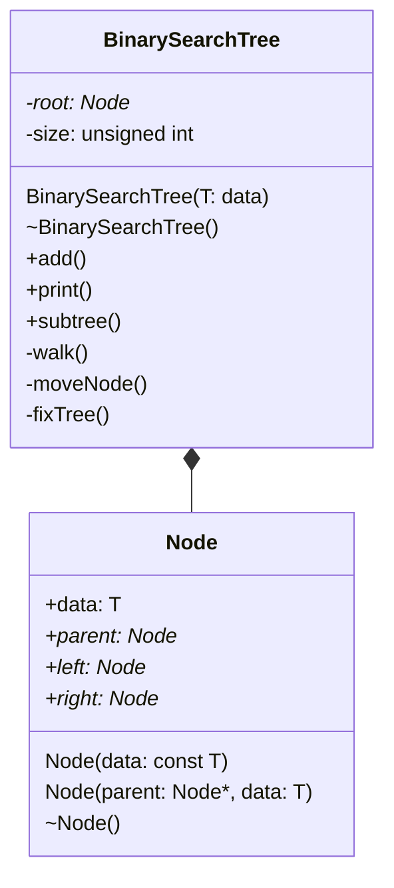
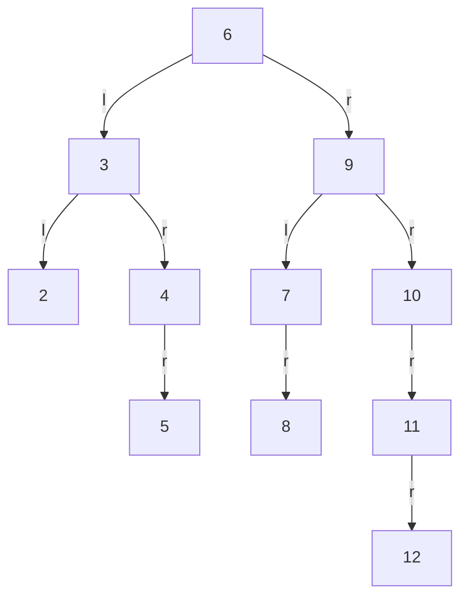

```mermaid
classDiagram
  class BinarySearchTree {
    -root: Node*
    -size: unsigned int
    BinarySearchTree(T: data)
    ~BinarySearchTree()
    +add()
    +print()
    +subtree()
    -walk()
    -moveNode()
    -fixTree()
  }
  class Node {
    +data: T
    +parent: Node*
    +left: Node*
    +right: Node*
    Node(data: const T)
    Node(parent: Node*, data: T)
    ~Node()
  }
  BinarySearchTree *-- Node
```

```mermaid
graph TD; 6 -- l --> 3; 3 -- l --> 2; 3 -- r --> 4; 4 -- r --> 5; 6 -- r --> 9; 9 -- l --> 7; 7 -- r --> 8; 9 -- r --> 10; 10 -- r --> 11; 11 -- r --> 12;
```