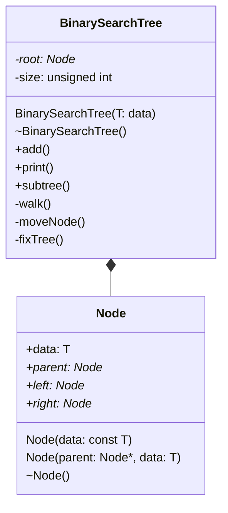
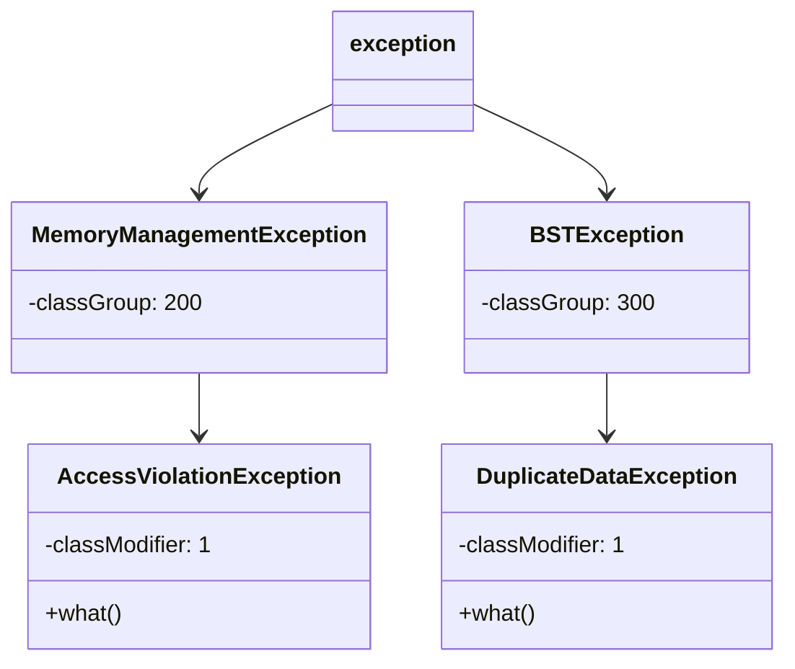

```mermaid
classDiagram
  class BinarySearchTree {
    -root: Node*
    -size: unsigned int
    BinarySearchTree(T: data)
    ~BinarySearchTree()
    +add()
    +print()
    +subtree()
    -walk()
    -moveNode()
    -fixTree()
  }
  class Node {
    +data: T
    +parent: Node*
    +left: Node*
    +right: Node*
    Node(data: const T)
    Node(parent: Node*, data: T)
    ~Node()
  }
  BinarySearchTree *-- Node
```

```mermaid
classDiagram
  class exception

  class MemoryManagementException {
    -classGroup: 200
  }
  exception --> MemoryManagementException
  class AccessViolationException {
    -classModifier: 1
    +what()
  }
  MemoryManagementException --> AccessViolationException

  class BSTException {
    -classGroup: 300
  }
  exception --> BSTException
  class DuplicateDataException {
    -classModifier: 1
    +what()
  }
  BSTException --> DuplicateDataException
```