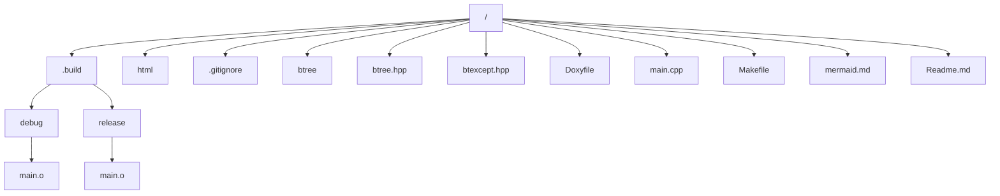
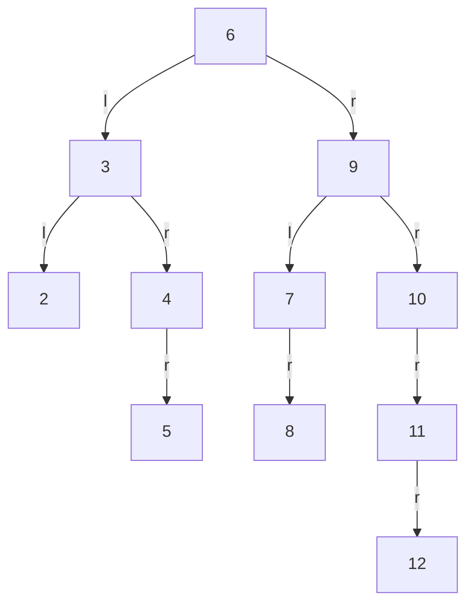
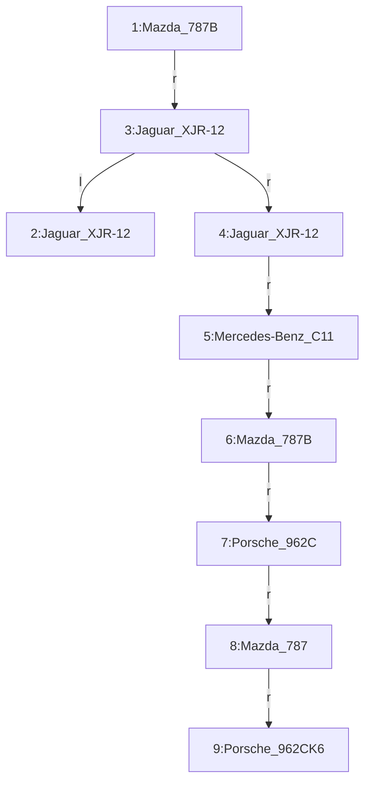

<!--
mermaid.md
Sorgente per i grafi Mermaid per il progetto "btree"
Esame di Programmazione C++ 20/04/20
Copyright (c) 2020 Jacopo Maltagliati <j.maltagliati@campus.unimib.it>
-->

> ***NOTA*** 
> Questo documento contiene le definizioni, generate automaticamente o manualmente, dei grafi utilizzati nel file Readme.md: e' possibile che alcune parti di questo documento non vengano visualizzate correttamente, in quanto Doxygen e di GitHub non implementano l'estensione della sintassi Mermaid. Si prega di consultare il file [Readme](./Readme.md).

# filesys_graph

# test_int_graph

# test_labeled_idx_graph

