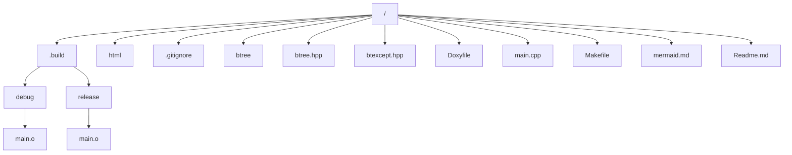

<!--
mermaid.md
Sorgente per i grafi Mermaid per il progetto "btree"
Esame di Programmazione C++ 20/04/20
(c) 2020 - Jacopo Maltagliati <j.maltagliati@campus.unimib.it>
Rilasciato sotto licenza MIT - Released under the MIT license
-->

> ***NOTA*** 
> E' possibile che alcune parti di questo documento non vengano visualizzate correttamente, in quanto il processore Markdown di Doxygen e di GitHub non implementano l'estensione della sintassi Mermaid. Si prega di consultare il file [Readme](./Readme.md).

# filesys_graph

